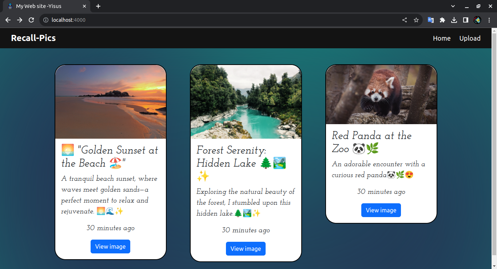
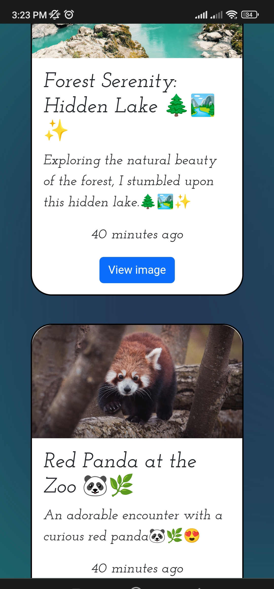
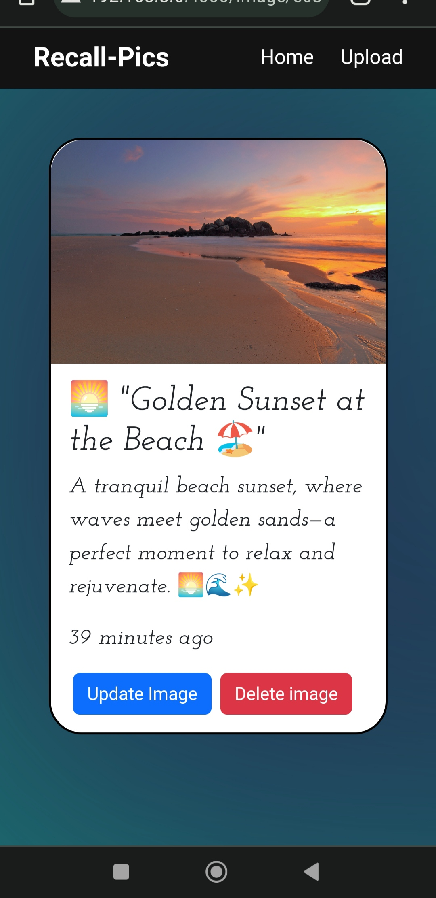

# Recall-Pics

Recall-Pics es una aplicación web construida con Node.js y Express que te permite crear, cargar, ver, editar y eliminar imágenes y recuerdos especiales. La aplicación utiliza una base de datos MongoDB para almacenar la información de las imágenes.

## Instalación

Para ejecutar este proyecto en tu máquina local, sigue estos pasos:

1. Clona este repositorio en tu máquina local.
2. Navega al directorio del proyecto
3. Ejecuta `npm install` para instalar las dependencias.
4. renombrar el `.env.example` a `.env`
5. Configura las variables de entorno necesarias:

- `MONGODB_URI`: Esta variable debe contener la URI de tu base de datos MongoDB. Puedes obtenerla a través de un servicio de MongoDB en la nube o configurar una base de datos local.

- `PORT`: Especifica el puerto en el que deseas ejecutar la aplicación.

6. Inicia la aplicación con el comando `npm start`.

La aplicación estará disponible en `http://localhost:<PORT>`.

## Uso

Recall-Pics ofrece las siguientes funcionalidades:

- **Galería de imágenes**: Accede a la página de inicio (index) de la aplicación para ver una galería de imágenes compartidas por otros usuarios.

- **Subir imágenes**: Utiliza la función de carga para subir tus propias imágenes y asociarlas con tus recuerdos. Puedes proporcionar un título y una descripción para organizar tus recuerdos.

- **Detalles de la imagen**: Haz clic en una imagen para ver detalles específicos, como su título, descripción y otra información relevante.

- **Editar imágenes**: Edita el título y la descripción de tus imágenes cargadas para mantener tus recuerdos actualizados.

- **Eliminar imágenes**: Elimina imágenes que ya no desees conservar. La imagen se eliminará de la base de datos y del sistema de archivos.

## Ejemplos de Imágenes

A continuación, te mostramos algunos ejemplos de imágenes y recuerdos que puedes encontrar en Recall-Pics. Estas imágenes son solo ejemplos y no representan datos reales de usuarios.

## Créditos

Este proyecto fue desarrollado por YisusAbet24 
